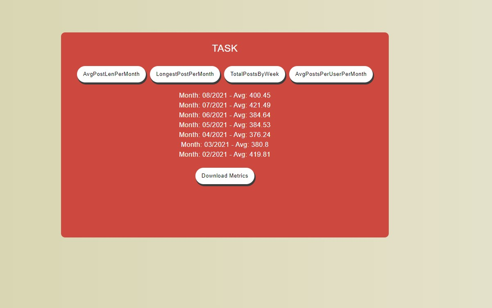

Fetch and manipulate JSON data from a fictional Metrics Social Network REST API.

## Installation

In the project directory, you can run:

- `npm install`
- `npm start`

---

## Usage

You can use method buttons to change metrics and download data.

---

## Methods

There are 4 methods;

- `avgPostLenPerMonth` Average character length of posts per month
- `longestPostPerMonth` Longest post by character length per month
- `totalPostsByWeek` Total posts split by week number
- `avgPostsPerUserPerMonth` Average number of posts per user per month

---

## Task Screen

